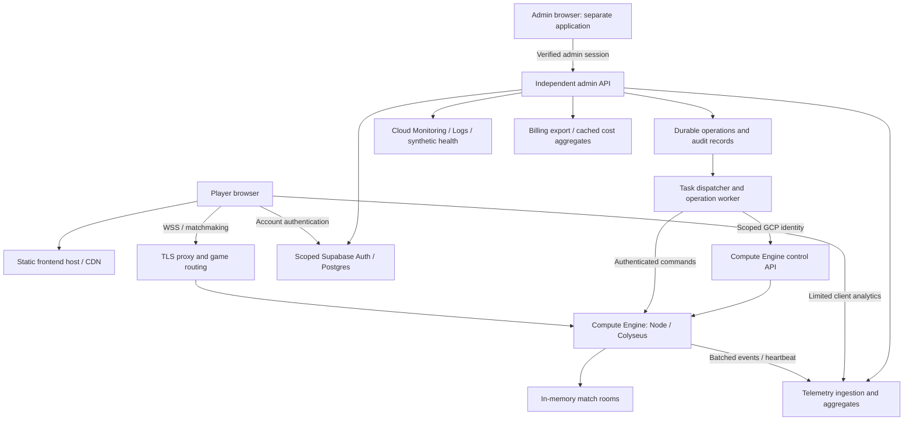

# ADM-01: Administration, analytics and deployment control

Status: **implementation started; local read-only foundation, not deployed**. Written 2026-10-06.

Implementation evidence and limitations: [foundation verification](admin-verification.md)
and [development guide](../admin-development.md). The contract below remains the
full target; a working local foundation does not satisfy its hosted release gates.

This document is the implementation contract for a robust ShootBall Arena admin panel. It defines requirements, data semantics, interfaces, rollout stages and acceptance gates. It does not authorize provisioning or change the current hosting setup. Workstreams remain planned or in progress until their acceptance evidence is complete.

## 1. Goal and scope

Provide one protected dashboard with left-side navigation for operating the game, understanding traffic and costs, viewing the full architecture, managing servers and editing validated gameplay configuration. Every displayed value must identify its source, environment, time window and freshness. Every consequential action must be authorized, traceable and recoverable where possible.

Required environments: local development and GCP test initially; production after release gates. Do not imply that these deployments already exist. Environment selection is persistent and unmistakable, particularly on mutation dialogs.

Project boundaries:

- GCP account: `gbjunior010@gmail.com`; project: `project-7915787f-37b2-4286-aa7`.
- Operator/CI GCP commands use repository `scripts/gcloud.cmd`; never change the global active configuration or select an unrelated project.
- Supabase reference: `lkgxpgcmspxekggndzih`; URL: `https://lkgxpgcmspxekggndzih.supabase.co`. No fallback project. Distinguish application environments explicitly in new operational data; this is not equivalent to separate database isolation.
- Development remains Node/npm with mocked provider adapters when needed. No Docker or local Supabase stack required for development. Production server images use Docker.
- No new paid resources are provisioned by this specification. Regional placement, test/production domains, VM capacity and monetary budgets are deployment inputs, not invented defaults.

## 2. Verified starting point and gaps

| Area | Repository today | Required change |
| --- | --- | --- |
| Browser | Vite/Phaser; account forms, lobby, gameplay; static media menu background | Separate admin application/bundle; no admin dependencies or privileged credentials in the player bundle |
| Gameplay | Node/Colyseus; one process, multiple in-memory rooms; eight human seats per room by default | Authenticated operations interface, telemetry, readiness and drain lifecycle |
| Entry point | `apps/game-server/src/index.ts`; configured loopback host; SIGINT/SIGTERM shutdown handlers | Production binding, supervised startup, explicit drain and restart behavior |
| Configuration | `packages/shared/src/config.ts` already is the master config; compile-time `CONFIG`, derived constants and browser imports | Serializable canonical document, strict schema, revisions and per-room config injection |
| Validation | `packages/shared/src/config-validation.ts` validates a typed draft | Validate untrusted JSON shape as well as semantics, resource bounds and map connectivity |
| Map | Absolute wall/spawn/pickup coordinates; changing dimensions does not resize them | Deterministic map presets/generator and a safe resize workflow |
| Accounts | Hosted Supabase Auth; ownership-protected profiles; temporary guests do not create Auth users | Admin membership, privileged paginated account directory, activity/session records |
| Analytics/costs | No implemented first-party DAU/MAU pipeline or billing dashboard | Event ingestion, aggregates, billing connector and freshness reporting |
| Hosting | Docs plan static frontend on Vercel, gameplay on Compute Engine; no deployment pipeline/image in repo | Explicit deployment manifest and provider inventory; do not display a fictitious GCP web pool |
| Scaling | Room overflow in one process; no distributed matchmaking | Keep one process initially; gate extra processes on shared presence, matchmaking and routing |

Related contracts: [hosting direction](../../shootball-arena-architecture.md), [deployment](../specs/deployment.md), [matchmaking](../specs/matchmaking.md), [account setup](../auth-setup.md), [game configuration](../game-config.md).

## 3. Dashboard navigation and UX requirements

Preserve the game's pixel design language while prioritizing readable operational tables. Use a fixed left sidebar on desktop and a collapsible navigation drawer on narrow displays. Selected environment, signed-in administrator, global search and last refresh appear in the header. Status uses text/icons as well as color. Dense tables support keyboard navigation, filters, pagination and accessible column labels.

| ID / tab | Required features |
| --- | --- |
| ADM-UI-01 Overview | Current humans online, active accounts/guests, DAU, rolling 30-day MAU, running/ready servers, live matches, error rate, estimated month cost, incidents, recent admin actions |
| ADM-UI-02 Traffic & engagement | Page visits, visitor estimates, guest button clicks, guest lobby entries, Play clicks, successful joins, failures, playtime, DAU/MAU, new/returning subjects, conversion funnel and historical trends |
| ADM-UI-03 Accounts & guests | Paginated registered-account directory; separate guest-session directory; current presence, last gameplay activity, join counts, account totals and guest totals with explicit definitions |
| ADM-UI-04 Servers & matches | VM/process inventory, desired versus observed state, health, occupancy, running rooms, version/config, start/drain/resume/restart/stop and selected-room closure |
| ADM-UI-05 Game settings | Searchable categorized editor over one master config, units/help, presets, map preview, validation errors, before/after diff, publish, rollout status, revision history and rollback |
| ADM-UI-06 Architecture & health | Interactive graph and accessible list of browser, frontend host/pool, routing/TLS, gameplay servers/rooms, admin services, Supabase, telemetry and billing dependencies |
| ADM-UI-07 Costs & usage | Daily/month-to-date spend, estimates versus provider-reported values, provider/service/resource breakdowns, forecast, budgets, unit economics and export |
| ADM-UI-08 Admin activity | Searchable append-only action history with actor, old/new values, target, reason, approval, result and correlation IDs |
| ADM-UI-09 Logs & alerts | Filtered operational logs, errors, disconnect spikes, degraded dependencies, stale telemetry, alerts and links to provider diagnostics |
| ADM-UI-10 Access & integrations | Admin role management, integration connectivity and scopes, environment/resource mapping, notification destinations and retention settings; never display secrets |

All tabs distinguish loading, empty, unavailable, stale and permission-denied. A disconnected integration is **unknown**, never zero cost, zero players or healthy. Historical graphs identify gaps instead of interpolating fabricated measurements. CSV export uses the same authorization and filters, escapes spreadsheet formulas, and is audited.

## 4. Proposed system architecture

The admin API and operation worker must remain available when every game VM is stopped. Place them in an independent service; proposed GCP deployment is Cloud Run for the admin API and authenticated task handlers, with a durable operations store and retryable task dispatch. This is a proposal for implementation, not a claim of existing resources. Provider adapters permit local fake implementations.

### Architecture tab contract

- Nodes come from an explicit deployment manifest reconciled with observed provider inventory. Each records resource ID, environment, region/zone, responsibility, build digest, config revision, safe endpoint, dependencies and owner.
- Show logical layers and expand them into actual VM/process/room nodes. Distinguish a VM from its container/process and a room from a server.
- The frontend node follows the actual host. With the current hosting plan, show Vercel/static hosting. If frontend hosting is moved to GCP, display its actual bucket/CDN or web-service/backend pool, replica counts and health. Until configured, show “Not provisioned”, not green replicas.
- Supabase appears as separate Auth, API and database capability checks. A responding public URL does not prove database health. Use a bounded read-only service query where credentials permit; never create users or mutate gameplay data as a health probe.
- Show DNS/TLS reachability and a gameplay handshake synthetic check. Synthetic checks must not occupy player seats or create persistent test rooms.
- Clicking a node shows current versus desired state, latency, last success/error, checks performed, permissions missing, related incidents and safe provider-console links.
- Game-server failure must not make the admin graph unavailable. Supabase/control-store failure disables unsafe mutations and exposes last-known state with its timestamp.

Proposed refresh targets: live server heartbeat every 10 seconds, stale after 30 seconds; account/presence cards within 15 seconds; dependency probes every 60 seconds; traffic aggregates within 5 minutes. Timeouts/retry jitter and maximum concurrent probes prevent the dashboard from becoming a source of load. Pause browser polling when hidden; backend observation remains independent.

## 5. Server and match control contract

### ADM-OPS-01: inventory and state

Show instance identity, zone, provider power state, process state, liveness, readiness, admission state, uptime, last heartbeat, CPU, memory, event-loop lag, tick duration p50/p95/p99, room count, connected humans, reserved seats, NPC count, network throughput, build/protocol version and desired/applied config revisions. No capacity claim may be inferred from the eight-player room limit.

Track separate state axes. A provider-running VM can have a failed process; a live process can be draining and not ready for new joins. A worker timeout is an unknown operation outcome until reconciled.

### ADM-OPS-02: allowed actions

| Action | Preconditions and behavior | Success evidence |
| --- | --- | --- |
| Start existing server | Operator role; resource belongs to environment allowlist; pre-provisioned VM; no duplicate pending operation | Provider running, process booted, config verified, health ready, routing enabled |
| Drain | Disable new joins/new-room allocation; allow authenticated reserved reconnects; continue existing games | Admission gate acknowledged and room/seat counts monitored |
| Resume admissions | Healthy compatible server, adequate capacity, valid config | Gate reopened and new joins succeed |
| Restart process | Drain first; supervisor performs restart; retain previous image/config | New process boot ID and healthy readiness; does not pretend old rooms survived |
| Stop VM | Drain to zero active rooms and reserved seats, then stop | GCP operation and observed stopped state agree |
| Force stop | Elevated role, fresh reauthentication, explicit affected-player count and typed target confirmation | Audit records forced termination and impacted rooms; observed VM state reconciled |
| Close selected room | Explain soft close (no new joins) versus forced end; reason required | Room marked/ended and clients receive maintenance result; no unrelated room changes |
| Start additional server | Deferred until distributed matchmaking gate passes; approved capacity/template limit | Routing and shared matchmaking proven, not merely a second running VM |

Stopping a process differs from stopping a VM; restarting is not deletion. Do not include arbitrary shell execution, free-form GCP commands, image URLs or resource deletion in the dashboard. Operators choose only registered targets and approved image/config versions.

### ADM-OPS-03: reliable operation workflow

1. Verify admin session, current role, environment, target allowlist, action-specific permission and expected target generation.
2. Show a preview with affected players/rooms, target, action, cost implications, timeout policy and reason. Require confirmation for disruptive actions; viewing/reloading does not require it.
3. Atomically write operation intent, audit entry and outbox event before external effects. Return `202` with operation ID. Reject a reused idempotency key with a different payload.
4. Worker claims a lease; serialize conflicting operations per target. Persist phase, lease/attempt, provider operation ID and observed state. Do not depend on a browser connection or one long HTTP request.
5. Execute bounded phases with retries. Reconcile provider results after crashes or lost responses before attempting another side effect. Retry delivery is expected; effects must be idempotent.
6. Record acknowledged result and final audit outcome. UI can reconnect and resume observing the same operation. Failure and partial success are explicit.

Drain deadline is configurable operational policy, initially proposed at 10 minutes for test review. Matches currently have **no time limit**, so drain may never complete naturally. At deadline default to “awaiting operator decision”; never silently force-stop players. Offer extend, cancel/resume, or explicit force stop. Maintenance UI must explain lack of capacity to waiting players and bound retries.

Stopping all game servers must leave a reachable maintenance/admission endpoint or a clear client connection-failure path. The admin API must still start a stopped VM. If admin persistence is unavailable, ordinary mutations fail closed; documented GCP break-glass recovery is external and reconciled into audit history afterward.

In-memory rooms do not survive process/VM restarts. Reconnect tokens from a previous boot must fail safely. No restore-match promise is part of this release.

### ADM-OPS-04: initial deployment constraints

- Initially operate one registered game process/VM; additional rows may be inventoried but not started as a shared player pool until routing/distributed presence is implemented.
- A managed-instance-group controller must not race manual start/stop. If adopted later, controls modify desired group capacity and instance protection, not unmanaged instance power behind the group's back.
- Restrict management commands to a private or independently authenticated channel with workload identity/mTLS as appropriate. Do not expose them as ordinary player room messages. Prove authentication against replay, stale commands and wrong-environment targets.
- Stable endpoint/DNS strategy must survive stop/start. Do not assume an ephemeral address remains stable.
- A stopped VM can still incur attached-resource charges; distinguish compute runtime savings from total cost. See [Compute Engine lifecycle guidance](https://docs.cloud.google.com/compute/docs/instances/stop-start-instance).

## 6. Master configuration and editor

### ADM-CFG-01: one complete gameplay document

Retain one canonical source for all tunable gameplay values. Proposed file: `config/game.master.json`, migrated from `packages/shared/src/config.ts`. It contains `schemaVersion` and the complete editable game configuration, with no secrets. Preserve current values during migration. Use a generated typed loader rather than maintaining two independently editable copies.

Distinguish three artifacts:

- **Master file:** source-controlled default, complete import/export format, bootstrap for local development and recovery.
- **Config revisions:** immutable copies of that same document shape in the operational store, with revision ID, content hash, base revision, author, reason, validation result and compatible build/schema versions.
- **Active pointer:** environment-specific desired revision, updated transactionally after publication. Applied process/room revisions are observed separately.

The UI edits a draft of the complete master document, not arbitrary source files on a VM. “Download master config” exports a revision; “Import” validates a complete document and produces a reviewable diff. Exporting does not silently commit to Git. Updating Git defaults is a separate reviewed repository change. On a running server, the published environment revision is authoritative; a file change cannot override it unnoticed.

Environment secrets, IAM, admin permissions, credentials and provider resource identities are operational settings in a separate protected deployment manifest/secret store. They are not editable gameplay fields or part of a client-visible “everything” file.

### ADM-CFG-02: field inventory and metadata

Every existing `CONFIG` leaf must be represented in the editor schema with path, label, type, unit, help, default, valid range/enum, visibility, dependency rules, change class and required role. No tunable field may remain hidden just because it lacks a hand-built form. Provide categorized controls plus an advanced JSON editor using the same schema.

| Category | Fields covered |
| --- | --- |
| Player | Health, radius, speed, respawn, spawn protection, all sprint/stamina values |
| NPCs | Enabled, health, speed, respawn, target population, maximum count, damage/cooldown, all detection/navigation/combat/retreat/variation parameters |
| Match | Win condition, point/kill targets, human/NPC/orb points |
| Weapons/projectiles | Damage, cooldown, speed, lifetime, pellets, spread, ammo, radius, muzzle offset |
| Pickups/radar | Collection/placement radii, healing, respawn, speed boost, drop limits/lifetimes/offsets, radar range/duration/cooldown |
| Map | Origin, dimensions, grid size, camera padding, walls, spawns, pickup pads; new generation seed, density and preset controls |
| Simulation/network | Tick/snapshot/input timings, catch-up limits, event history, navigation clearance, seats, reconnect, payload/message limits, interpolation and ping settings |
| Presentation | Viewport, camera, effects, health thresholds, feed limits, audio ranges/volume/tones; client synchronization required |
| Legacy drill | Existing practice-target fields under an explicit legacy section |
| Process | Existing host/port exposed as deployment-only values; not runtime gameplay edits |

Inventory additional tunable literals outside `CONFIG` before declaring coverage complete. Constants defining algorithms, protocol discriminants, DOM structure, access-control rules and security invariants are not arbitrary admin knobs. Document each excluded constant and why. Schema coverage tests fail if a tunable key has no metadata.

### ADM-CFG-03: map size and barrier density

- Support named presets, custom width/height, deterministic seed, barrier area coverage, barrier count cap, size ranges, spawn count and pickup density. Define barrier density as non-overlapping barrier area divided by playable map area, not an ambiguous slider.
- Manual map mode retains exact coordinates. Resizing requires an explicit regenerate or reviewed coordinate-transform choice; never leave old coordinates silently out of bounds.
- A seeded generator materializes exact walls/spawns/pickup pads once on the server. Store seed, generator version, requested/achieved density and generated layout/hash in the revision. Clients render that layout rather than independently regenerating it.
- Reject impossible density, blocked/narrow routes, spawn overlap, insufficient spawn clearance, isolated pickup regions and resource counts above approved limits. Use clearance for both human and NPC radii and prove required walkable connectivity. Bound generation attempts/time and report failure without publishing a partial map.
- Provide a pixel map preview with collision bounds, spawn/pickup markers, unreachable areas and estimated entity count; compare old/new geometry. Run a local deterministic bot preview without matchmaking, player seats or backend simulation.
- NPC population mode defaults to existing fill behavior: with at least one human, `min(maxCount, max(0, targetPopulation - humanSeatCount))`; zero NPCs with zero humans. Precisely define connected/reserved-seat handling to match server behavior. If adding an NPC-per-human ratio mode, expose it as a distinct mutually exclusive mode with an explicit rounding rule and hard cap.

### ADM-CFG-04: safe application and rollback

| Change class | Examples | Application |
| --- | --- | --- |
| Operational immediate | Accept-new-matches gate, diagnostic sampling | Acknowledged process command, audited |
| Next match | Player/NPC stats, weapons, pickups, scoring, map layout | New immutable room config; existing rooms keep their original revision |
| Process restart | Tick scheduler, transport/payload limits, binding/port | Validated deployment revision; drain/restart procedure |
| Coordinated client/server release | Protocol shape, unsupported schema, client-bundled behavior/assets | Build compatibility gate and coordinated deployment; never present as live-editable |

All fields have an explicit class, with restart/redeploy as the conservative fallback. Publishing shows the resulting action; it must not pretend that changing a database row updates compiled constants.

Refactor the shared simulation, bots, arena geometry, derived `GAME`/`ARENA`/weapon constants, protocol limits and Phaser rendering to consume injected immutable config. A room snapshot/handshake includes revision, schema/build compatibility, generated map and the client-safe configuration needed for rendering and input. Never mutate global `CONFIG` while multiple rooms use it.

New matchmaking after publication selects rooms using the eligible revision; old-revision rooms continue existing participants/reconnects but do not silently absorb new joins intended for the new rules. Track multiple simultaneously running revisions explicitly. Test two rooms with different speeds/maps in one process for isolation.

Workflow: draft -> strict validation -> map/resource validation -> diff/impact preview -> publish with expected base revision -> process acknowledgment -> new-room activation -> observation. Concurrent edits return `409` with a rebase/diff path. Schema validation rejects unknown keys, missing required fields, wrong types, NaN/infinite values, oversized arrays and values outside approved ranges.

Rollback creates a new auditable publication of an earlier compatible revision; it does not rewrite history or alter ongoing rooms. Failed application leaves last-known-good configuration running and displays desired/applied mismatch. Do not silently bootstrap a different revision if the authoritative config cannot be retrieved; only use an explicitly approved cached revision policy.

Changing map/artwork may make the menu film stale. Show a regeneration reminder using `npm run background:generate`; never run an encoder inside the live game process as part of a settings save.

## 7. Traffic, accounts, guests and activity definitions

### ADM-DATA-01: metric dictionary

Store event timestamps in UTC. Use `America/Chicago` as the initial dashboard reporting timezone; show it beside date controls. Calendar windows honor daylight-saving boundaries. A timezone change recomputes aggregates; never relabel previously grouped data.

| Metric | Exact meaning / limitations |
| --- | --- |
| Registered accounts | Current non-guest Auth users in the scoped project, as of last successful directory synchronization; report deleted/disabled cohorts separately |
| New accounts | Account creation events in the selected period; not inferred solely from current surviving accounts |
| Guest button clicks | Accepted client `guest_selected` events; show total events and distinct measured browser sessions separately; repeated clicks are not new people |
| Guest lobby entries | Successful transition to guest lobby, distinct from clicking Play or joining gameplay |
| Unique guest visitors | Distinct pseudonymous first-party guest identifiers observed in window; explicitly an estimate of browsers, not people; reset storage/multiple devices can overcount |
| Active guests / active accounts now | Distinct identity subjects with a live gameplay presence heartbeat within 30 seconds; show socket count separately |
| Connected humans / reserved seats / NPCs | Three different server-reported counts; reserved reconnect seats and bots are not active humans |
| Gameplay DAU | Distinct account or guest subjects with at least one server-confirmed gameplay join or gameplay presence interval overlapping that local calendar day; exclude NPCs, staff test traffic and synthetics |
| Gameplay MAU (30 days) | Distinct subjects meeting the DAU activity definition across the selected local day and preceding 29 days; not a sum of DAUs |
| Calendar-month active | Separate metric for a selected calendar month; never ambiguously label both windows MAU |
| Site-active visitors | Distinct measured browser sessions/visitor estimates on frontend; distinct from gameplay DAU |
| Total active player identities | Union of account IDs and guest pseudonyms in the window; show breakdown and dedup policy, never claim a count of unique humans |
| Total players ever observed | Since analytics collection began, according to retained aggregates; report coverage start and identity limitations, not a fictional all-time total |
| Playtime | Server-derived session intervals with bounded heartbeat gaps; union overlapping sessions per subject to prevent double-counting |
| Conversion | Measured guest-selection -> lobby -> Play -> successful join -> account creation funnel; report counts, denominators and instrumentation loss |

Guests remain guests; do not create Supabase Auth accounts just to count them. Guest analytics identifiers must be unrelated to reconnection credentials and must not be fingerprinted from IP/device characteristics. Use random first-party identifiers where storage/privacy policy permits; storage-denied visits use a session-only fallback and report reduced continuity.

When a guest signs in, record an explicit conversion link under the chosen privacy policy; retain original event identity and offer a clearly labeled deduplicated-session report. Do not retrospectively assume every guest on a shared device was the same account. A page reload/reconnect is not a new human, and current socket counts are not DAU.

### ADM-DATA-02: event pipeline

Minimum events: `page_view`, `guest_selected`, `guest_lobby_entered`, `play_requested`, `join_succeeded`, `join_failed`, `session_heartbeat`, `session_ended`, `account_created`, `login_succeeded`, `guest_converted`, `room_started`, `room_ended`, `server_booted`, `server_draining`, `server_stopped`.

Each event has a versioned schema, unique event ID, producer, environment, occurred/received time, pseudonymous subject, session ID, optional server/room/config revision and allowlisted properties. Server-confirmed events are authoritative for gameplay; client counts are explicitly lower-trust and may be blocked or spoofed. Validate and rate-limit ingestion, constrain payload size/time skew, deduplicate retries and reject unknown properties. Do not accept arbitrary account identity claims from clients.

Batch asynchronously outside the simulation tick. Bound queues, drop low-priority samples before gameplay degrades, count dropped events and show analytics completeness. Reconcile server restarts and missing session-end events with heartbeat timeout. Auth account counts come from privileged server-side synchronization, not client login events alone.

Persist raw events in restricted storage and maintain indexed daily subject/activity aggregates. The same-subject multi-tab and cross-midnight cases must have fixtures. Analytics ingestion must never allow a public client to read records, edit aggregates or write admin audit entries.

Proposed retention for review before public release: raw analytics 90 days, pseudonymous daily aggregates 13 months, detailed operational logs 30 days, audit records 12 months. Retention/deletion jobs are part of implementation. Define deletion/anonymization handling for account requests, exports and retained audit actor references; exclude tokens, passwords, reset URLs, email content and raw gameplay input from telemetry. Do not collect exact IP histories for product analytics.

### ADM-DATA-03: account and guest directory

Account rows: stable internal ID, display name, created time, account status, last login when supported, last gameplay activity, current presence and historical play/session totals from collected data. Email is restricted to a dedicated support permission and masked by default. Sort/filter/page server-side; explain independently stale account versus presence data.

Guest rows: pseudonymous ID, first/last observed timestamps, active/ended session state, join/play counts and conversion indicator where supported. Show no invented email or registered profile. Provide summary cards for account count, observed guests, active guests, active accounts, connected humans and NPCs.

Account listing uses a server-side privileged adapter; ordinary profile RLS is not widened into a public directory. Supabase's [admin user-list API is server-only](https://supabase.com/docs/reference/javascript/auth-admin-listusers). Account deletion, bans, impersonation and editing private credentials are not implicit permissions of the list view; defer them to separate audited moderation requirements.

## 8. Cost of operation

### ADM-COST-01: sources and presentation

- GCP costs: enable scoped Cloud Billing export to BigQuery during deployment setup; query only the pinned project's data with environment/resource attribution. Present provider-reported usage charges, credits and net cost separately. Billing export is periodic, not a real-time meter; show the latest available usage/export timestamp and incomplete-day warning. [Billing export documentation](https://docs.cloud.google.com/billing/docs/how-to/export-data-bigquery)
- Show VM runtime, disks, external addresses, network egress, load balancer/CDN where present, registry storage, admin runtime, tasks, logging/monitoring and analytics/billing-query overhead. Stopping the game does not imply zero remaining cost.
- Supabase and frontend-host charges are separate provider inputs. Use supported billing/usage sources when available; otherwise allow audited invoice/manual cost entries and label them. Never assume a nonexistent Supabase billing API or count the full plan fee once per environment.
- Track shared/unallocated charges explicitly. Do not mix billing-account totals with project-only totals. Preserve currency, tax/credit treatment, source, invoice period and allocation rule. Avoid combining currencies without a displayed conversion source/date.
- Refresh cached cost summaries on a bounded schedule (initially hourly), not an unbounded BigQuery scan per dashboard view. Partition filters, query limits and monitoring bound the cost of the cost dashboard itself.

Required charts: daily costs, month-to-date actual-to-date, separately labeled recent usage estimate, month-end forecast with methodology, provider/service/environment breakdown and configurable budget thresholds. Missing source data shows “Unavailable” and whether the total is partial. Never add an estimate to actuals covering the same usage period.

Unit economics: cost per server-hour, per completed gameplay-hour, and per DAU/MAU for a matching period; handle zero denominators as N/A. Forecasts and budgets do not automatically stop servers. Any future automated shutdown policy needs a separate approved specification because budgets are alerts, not guarantees of a hard spending cap.

## 9. Admin permissions and immutable activity history

### ADM-SEC-01: roles

| Role | Permissions |
| --- | --- |
| Viewer | Health, redacted aggregate metrics and architecture |
| Analyst | Viewer plus analytics/cost breakdowns and approved redacted exports |
| Operator | Viewer plus registered-server start/drain/resume, planned restart/stop and room controls |
| Config editor | Draft, validate and preview configs; cannot publish alone |
| Config publisher | Publish/rollback compatible revisions with impact review |
| Owner | Assign/revoke roles, approve force actions and integration changes; restricted account-data access remains explicit |

Roles may be combined for an initial single administrator, but server-side permissions must remain separate. No self-enrollment or authorization based on a display name/email string alone. Bootstrap the first owner via an out-of-band, audited deployment step with a verified Auth user ID. Ordinary users cannot modify role membership or grant themselves claims.

Require MFA for administrators and fresh verification for role changes/forced termination. Verify tokens server-side and current membership on privileged requests; stale JWT role claims alone must not preserve revoked access. Define session expiry, logout and revocation behavior. Protect cookie-based mutations against CSRF; restrict admin origins and escape all user/config/log display values. Rate-limit login and mutation endpoints.

GCP calls use a dedicated least-privilege runtime identity, bounded to registered resources/actions. User GCP account credentials and service-account JSON keys never go to the browser. Runtime API calls use provider SDKs and explicit project/target validation; the repository gcloud wrapper is for operator/CI commands, not concatenated user input.

New admin/config/analytics tables use an unexposed schema or explicit restrictive grants/RLS. Normal `anon`/`authenticated` clients cannot read admin data. Privileged Supabase credentials, if required, stay in the trusted API/worker secret store. Views/functions must not accidentally bypass the intended policy. Game servers receive narrowly scoped read/append capabilities, never role-management or billing access.

### ADM-AUD-01: audit event contract

Every mutation, rejected privileged attempt, sensitive account lookup/export, role change, import, publish, rollback and server operation records actor, effective role, environment, target, action, reason, UTC time, request/correlation/idempotency IDs, authorization result, before/after values or revision IDs, approval context and final outcome.

Example presentation:

> 2026-10-06 14:32 America/Chicago — Admin A published test config r18: `player.speed` changed from **220 px/s** to **250 px/s**. Applies to new matches. Reason: movement playtest. Server acknowledgment: applied to new-room default; 2 existing rooms remain on r17.

Store requested, accepted, applied, failed and reconciled outcomes as distinct immutable events linked to one operation. The mutable job row is not the audit ledger. Transactional changes pair their audit entry in the same transaction; external operations use durable intent/outbox before execution. If audit persistence fails, refuse ordinary mutations. Record partial external success when connectivity returns.

Application roles cannot update/delete audit events. Retention removal is a separately authorized maintenance action. Export audit records to independently protected storage if tamper evidence beyond database administrator trust is required; do not call an ordinary database table absolutely tamper-proof. Redact secrets and sensitive values in diffs while retaining field names and revision hashes.

## 10. Data model and API contracts

Proposed logical records (physical migrations come during implementation):

| Record | Key fields / constraints |
| --- | --- |
| admin_memberships | Auth user ID, roles, environment scopes, granted/revoked metadata; trusted-only writes |
| environments / resources | Explicit project/provider IDs, allowed actions, region/zone, desired state, observed generation |
| config_revisions / publications | Immutable document, schema/hash/base/author; environment active pointer with compare-and-swap |
| operations / outbox | Idempotency key + caller/environment uniqueness, target lease, state/phase, retry count, provider operation ID |
| admin_audit_events | Append-only ID, actor/action/target, old/new references, correlation and outcome |
| server_heartbeats / room_status | Server boot ID + monotonic sequence, revision, timestamp, counts; TTL distinguishes stale from zero |
| analytics_events / sessions | Unique event ID, producer/trust level, pseudonymous subject, environment and bounded properties |
| daily_active_subjects / daily_metrics | Unique environment/reporting date/subject; definition version and coverage window |
| account_directory_cache | Auth ID, allowed summary fields and synchronization timestamp; no auth credentials |
| cost_snapshots / manual_cost_entries | Provider/project/resource/period/currency/source, actual/estimated classification, adjustments |

Suggested versioned endpoints, all with role/environment checks except strictly limited public ingestion:

| Endpoint | Contract |
| --- | --- |
| `GET /admin/v1/overview`, `/architecture`, `/servers`, `/rooms` | Cached observed data with `observedAt`, `staleAfter`, source and availability |
| `POST /admin/v1/servers/:id/actions` | Allowlisted action, reason, expected generation, idempotency key; `202 operationId` |
| `POST /admin/v1/rooms/:id/actions` | Explicit close/drain/force action and affected target revision |
| `GET /admin/v1/operations/:id` | Durable phase/outcome, not simulated progress |
| `GET /admin/v1/config/schema`, `/config/revisions` | Editor metadata and authorized revisions |
| `POST /admin/v1/config/validate`, `/config/revisions`, `/config/publish` | Strict draft validation; create immutable revision; publish with expected base |
| `GET /admin/v1/accounts`, `/guests`, `/analytics`, `/costs`, `/audit` | Cursor pagination, bounded dates, redaction and definition/freshness metadata |
| `POST /telemetry/v1/events` | Bounded allowlisted client events only; no arbitrary database writes |

Use consistent `400/422` validation, `401/403` auth, `409` conflict, `429` rate limit and `503` dependency-unavailable semantics. Errors must not leak tokens, SQL, private addresses or provider credentials. Resolve user-selected logical IDs through the resource registry rather than trusting raw URLs, shell strings or project IDs.

## 11. Spec-driven delivery plan

Each workstream requires its own implementation evidence before status changes from planned to verified. All features remain in scope; phases prioritize the GCP test path rather than silently dropping analytics or costs.

| Workstream | Dependencies | Deliverable / touched areas | Status |
| --- | --- | --- | --- |
| ADM-01A Contracts | none | Schema/field inventory, metric dictionary, resource manifest, roles, threat review and API types | in progress: resource manifest and observation types |
| ADM-01B Admin foundation | A | Separate `apps/admin` and `apps/admin-api`, verified login, membership checks, sidebar, restricted storage, audit/outbox | in progress: separate apps and local-only read access; hosted auth/storage pending |
| ADM-01C Master config | A, B | Canonical JSON + metadata/schema, shared factories, config revisions, renderer handshake, map validation/generation | planned |
| ADM-01D Server operations | A, B | Health/admission endpoints, heartbeat, durable worker, local fake GCP adapter, start/drain/stop and room control | in progress: fixture and read-only GCP inventory adapters; mutations pending |
| ADM-01E Analytics/accounts | A, B | Event ingestion, guest identity policy, directory adapter, sessions, aggregates and tab UI | planned |
| ADM-01F Architecture/health | B, D | Provider manifest reconciliation, independent probes, interactive graph, stale-state handling | in progress: logical architecture, registered inventory and unknown-state UI |
| ADM-01G Costs | A, B | Billing export connector, cached costs, external/manual provider costs, budgets/forecast | planned |
| ADM-01H GCP test release | B-D, F; E/G adapters at least configured or explicitly unavailable | Production images, restricted IAM/networking, deployment/rollback automation and hosted acceptance evidence | planned |
| ADM-01I Public release | A-H | Complete analytics/cost coverage, load/soak/security checks, runbooks and final sign-off | planned |

Proposed implementation locations: `apps/admin/`, `apps/admin-api/`, `packages/admin-contracts/`, `config/game.master.json`, `config/game.schema.json`, config metadata in shared code, scoped migrations under `supabase/migrations/`, deployment manifests/scripts under `deploy/` and `scripts/`. These paths are proposed; no empty scaffolding is required for this spec deliverable.

## 12. Acceptance scenarios

| ID | Given / when | Required observable result |
| --- | --- | --- |
| ADM-AC-01 | Guest or ordinary account requests admin UI/API or analytics tables | No privileged data/actions; API and database authorization both deny |
| ADM-AC-02 | An admin is revoked while retaining an old token | Next privileged request is denied; prior membership claim is insufficient |
| ADM-AC-03 | All game VMs are stopped; authorized operator starts registered target | Dashboard remains available; real operation transitions through boot/readiness; exactly one start effect |
| ADM-AC-04 | Start/stop request is retried or worker crashes after provider acceptance | Same operation resumes/reconciles; no contradictory/duplicate external effect |
| ADM-AC-05 | Drain begins during active matches | New admissions stop, existing play and eligible reconnects continue; zero-room stop or explicit timeout decision |
| ADM-AC-06 | Force stop requested | Target/player impact shown, elevated authorization/reason/confirmation required, audit and maintenance UX verified |
| ADM-AC-07 | Edit `player.speed` from 220 to 250 and publish | Validated diff/audit; new match uses 250, old match remains 220, each client agrees with its server |
| ADM-AC-08 | Two admins publish from the same base | One publication wins; other receives conflict without lost update |
| ADM-AC-09 | Import invalid geometry/unknown keys/oversized entity counts | Field-specific rejection, no publication or runtime mutation |
| ADM-AC-10 | Generate same map seed/preset/version twice | Identical layout hash; all spawns and required routes valid; impossible density fails boundedly |
| ADM-AC-11 | Roll back while mixed-revision rooms exist | New rooms use rollback revision; existing rooms remain unchanged; desired/applied state visible |
| ADM-AC-12 | Guest double-clicks, reloads, reconnects, then signs in | Clicks/sessions/subjects/conversion counts follow documented definitions; no extra Auth guest user |
| ADM-AC-13 | Gameplay session crosses midnight/DST, or opens two tabs | DAU and interval-union playtime correct; rolling MAU distinct, not sum of daily counts |
| ADM-AC-14 | Events duplicated, late, forged or analytics collector unavailable | Dedup/validation works; incomplete coverage shown; gameplay remains healthy |
| ADM-AC-15 | Supabase/API/probe fails or heartbeat becomes stale | Correct dependency and age shown; no false healthy/zero; unsafe writes disabled |
| ADM-AC-16 | Billing data delayed or frontend/Supabase costs missing | Partial totals and timestamps labeled; estimates not presented as final invoice or double-counted |
| ADM-AC-17 | Role change/export/config edit succeeds or fails | Searchable before/after audit and outcome; no credentials leaked; app cannot alter audit history |
| ADM-AC-18 | VM restarts or config acknowledgment is lost | Restart loss of rooms handled; safe reconnect failure; revision mismatch reconciled |
| ADM-AC-19 | Multiple server processes requested before cluster support exists | Action disabled with explanation; no fragmented implicit matchmaking pool |
| ADM-AC-20 | Dashboard tested at 1920x1080, 2560x1440 and 390x844 | Navigation/tables/dialogs usable, destructive target visible, keyboard/focus and contrast verified |
| ADM-AC-21 | Config schema evolves or old client connects | Unsupported revisions/clients rejected clearly; coordinated release gate prevents silent mismatch |
| ADM-AC-22 | Runtime identity targets another GCP/Supabase project | Both application allowlist and cloud/database permissions prevent action |

Test layers: schema/unit tests; database permission/migration tests against the scoped hosted setup when needed; real local Colyseus integration with multiple config revisions; fake-provider failure/retry tests; browser interaction and visual review; isolated GCP staging operations and real billing/health integration. Capture commands, build IDs, screenshots, observed operations and remaining limitations in a new ADM verification record. A mocked start button is not cloud acceptance evidence.

## 13. GCP deployment and operational release gate

Before the first GCP test deployment:

1. Confirm environment resource names, region/zone, frontend host/domains, static endpoint strategy, budget limits and initial owner ID. Verify billing/API access using only the pinned project.
2. Build/version independent admin and game artifacts; add production game image, non-root runtime, health endpoints, signal behavior and immutable digest references. Keep local Node development working.
3. Provision narrowly scoped runtime identities, private management access, HTTPS/WSS routing and allowed origins. Maintain a permission matrix for inventory/start/stop/monitoring/billing versus player traffic. No project-owner credentials in application runtime.
4. Apply reviewed restricted tables/policies and bootstrap owner; configure secrets outside master config. Verify normal player RLS still works and old account flows remain intact.
5. Configure durable operation dispatch, retries/reconciliation, readiness/admission ordering, caching and previous-image/config rollback. Test that the admin system works with the game VM stopped.
6. Configure provider inventory/health sources, telemetry coverage, billing export permissions and explicit unavailable states for unfinished connectors. Establish budget alerts and log retention before load tests.
7. Verify deployed Auth redirects, actual Google login and recovery email delivery separately from mocked browser tests; verify no admin privilege leaks into player clients.
8. Execute start -> readiness -> two-device gameplay -> publish new-room config -> drain -> stop -> start, including interrupted-worker and failed-health cases. Record the expected loss of in-memory matches on forced restart.
9. Measure concurrent rooms/humans, bots, CPU/RAM, tick delays, network throughput and admin/analytics overhead. Approve per-server admission limits from measurements, not assumed player capacity.
10. Document runbooks for stuck operation, prolonged drain, Supabase outage, stale config, expired credentials, billing gap, bad deployment and break-glass recovery. Confirm rollback and audit reconciliation before production.

Before public production, all required tabs and acceptance cases must have evidence or an explicitly accepted limited status. Resolve the proposals below; do not silently turn them into production policy.

## 14. Decisions to resolve during implementation

- Frontend stays on the existing Vercel plan or moves to GCP; what “web pool” means in the chosen deployment.
- Test/production domains, region, VM sizing and monthly budget; initial owner(s) and whether publication needs a second administrator.
- Final retention/privacy policy, guest identifier continuity/consent behavior and account deletion treatment.
- Approved bounds for every advanced config field, map density/resource caps, and drain deadline/maintenance policy.
- Supabase/frontend cost data availability and shared-cost allocation; billable admin/analytics services and acceptable freshness.
- Production availability target, backup/restore objectives, alert thresholds and maximum telemetry overhead, based on GCP test measurements.

These are configuration/release decisions; they do not block implementing the local dashboard, contract schemas, fake adapters and acceptance fixtures.

## 15. External implementation references

- [Compute Engine stop/start lifecycle](https://docs.cloud.google.com/compute/docs/instances/stop-start-instance): reconcile provider operations and lifecycle costs.
- [Cloud Run task execution](https://docs.cloud.google.com/run/docs/triggering/using-tasks): independent authenticated task handlers; keep operation state durable across retries.
- [Service-to-service authentication](https://docs.cloud.google.com/run/docs/authenticating/service-to-service): workload credentials and protected service invocation.
- [Cloud Billing export](https://docs.cloud.google.com/billing/docs/how-to/export-data-bigquery): periodic provider cost data with explicit freshness.
- [Cloud Monitoring overview](https://docs.cloud.google.com/monitoring/docs/monitoring-overview): health/metrics and uptime signals.
- [Supabase admin user listing](https://supabase.com/docs/reference/javascript/auth-admin-listusers): trusted-server-only account directory access.

Original specification evidence: repository inspected and official references reviewed. Subsequent implementation evidence is recorded in [foundation verification](admin-verification.md); no GCP resources, migrations, configuration publication or analytics ingestion have been deployed.
